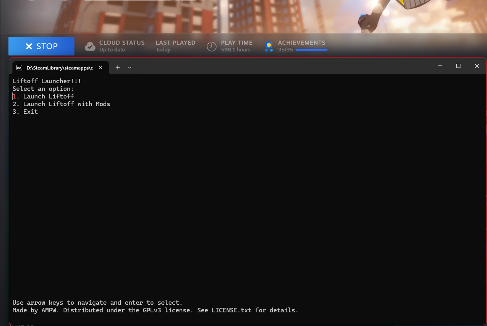

# LiftoffModLauncher

Simple launcher for Liftoff: Drone Racing to easily start the game with and without mods.

### Disclaimer
Only the windows build is tested and supported. The Linux and MacOS builds are untested and may not work.\
Please report any issues you encounter on the [Issues](https://github.com/AMPW-german/LiftoffModLauncher/issues) page.\
The launcher is not affiliated with or endorsed by LuGus Studios. It is a third-party tool created by the community to enhance the modding experience for Liftoff: Drone Racing.\
The launcher has a size of ~70-80MB due to the .NET runtime being bundled with it. It is a standalone application and does not require any additional dependencies to run.

## Installation

1. Download the latest release for your OS from the [Releases](https://github.com/AMPW-german/LiftoffModLauncher/releases) page.
2. Extract the downloaded archive to a folder of your choice (can be in the same folder as the game).
3. Open Steam and go to your Library. Right-click on Liftoff: Drone Racing and select "Properties".
4. In the "General" tab, click on the "Launch Options" input field and write the FULL path to the LiftoffModLauncher executable in quotes followed by %command%. E.g.:\
   "D:\SteamLibrary\steamapps\common\Liftoff\LiftoffModLauncher-win-x64.exe" %command%\
   It will fail if you don't use the FULL PATH to the executable.

## Building from source
Open a terminal in the root folder of the repository and run run the build.bat script. It builds the project for all platforms.
