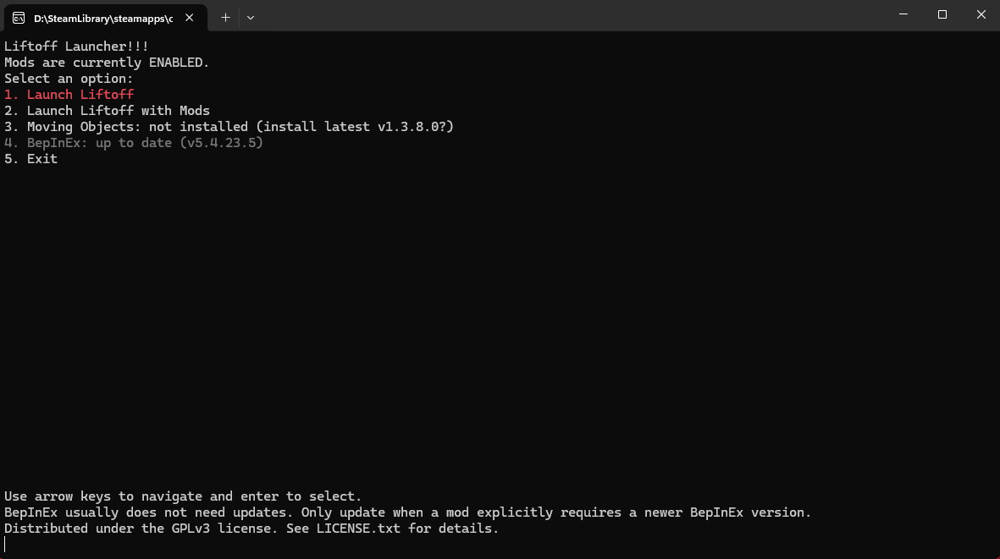

# LiftoffModLauncher

Simple launcher for Liftoff: Drone Racing to easily start the game with and without mods.

## Features

- **Launch with or without mods** from a single menu — toggling mods on or off before the game starts.
- **Setup helper:** when you run the launcher directly (not via Steam) it prints the exact Steam launch-options line for *your* install, with the full path and quotes already filled in.
- **Moving Objects update checker** (new): on startup the launcher checks the installed
  [Liftoff.MovingObjects](https://github.com/geekhostuk/Liftoff.MovingObjects) mod against the latest
  release and lets you update it in place with a single key. See below.

## Mod update checking

When the launcher opens it reads the version of the installed `Liftoff.MovingObjects.dll` and compares it
against the latest [GitHub release](https://github.com/geekhostuk/Liftoff.MovingObjects/releases). The result
is shown as a hint line under the mods status:

- `Moving Objects: up to date (v1.3.6)` — you have the latest version.
- `Moving Objects: UPDATE available v1.3.7 (installed v1.3.6) - press U to install` — a newer release exists.
- `Moving Objects: not installed` / `... (couldn't check for updates)` — the mod is missing, or the check
  could not reach GitHub.

The check runs in the background, so an offline or slow connection never blocks or delays the menu. When an
update is available, press **U** to download the release, extract it, and replace the plugin and patcher DLLs
in place. Each replaced file is backed up first and automatically rolled back if anything goes wrong.

### Disclaimer
Only the windows build is tested and supported. The Linux and MacOS builds are untested and may not work.
Please report any issues you encounter on the [Issues](https://github.com/AMPW-german/LiftoffModLauncher/issues) page.

## Installation

1. Download the latest release for your OS from the [Releases](https://github.com/AMPW-german/LiftoffModLauncher/releases) page.
2. Extract the downloaded archive to a folder of your choice (can be in the same folder as the game).
3. **Double-click the launcher executable once.** Because it wasn't started by Steam, it shows a setup screen and prints the exact launch-options line for *your* install, already containing the full path and quotes, e.g.:\
   `"D:\SteamLibrary\steamapps\common\Liftoff\LiftoffModLauncher-win-x64.exe" %command%`
4. Open Steam and go to your Library. Right-click on Liftoff: Drone Racing and select "Properties".
5. In the "General" tab, paste that line into the "Launch Options" input field.

> **Note:** A full path is required — a relative path such as `.\LiftoffModLauncher-win-x64.exe` will not work, because Steam does not set the launcher's working directory to the game folder. Using the line the launcher prints in step 3 avoids having to type the path by hand.

## Building from source
Open a terminal in the root folder of the repository and run run the build.bat script. It builds the project for all platforms.
